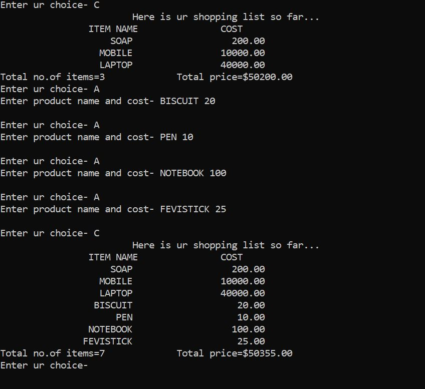

### Shopping-List-Implimentation-with-all-data-structures-possible
Created a basic shopping list using all the general types of data structures possible to keep up with the challenge made to me by my mentor

**what was the challenge you ask??**

So, here is a small story for you. When I was at my second year of college, I got really interested studying the concepts of data structures and wanted 
to explore it more and more and wanted to build some project on it that might not make any sense but must include all the concepts I have gathered in data structure.
So since I wasn't able to come up with any such idea for a project I decided to ask my mentor for help...

He told me to build a shopping cart that will have every feature like adding items to the cart, deleting items, last seen item, looking at a particular item etc.
The most interesting part of the project was that he told me to build the entire project using every data Structure I know of no matter how non-sense the algorithm and
code thus formed might sound. So that is what I did. I implemented every data structure that I knew of at that time and compiled it all together. It includes every data 
structure like linked list, stacks, queues, circular linked list, tree, heaps etc.

The rest of the thing I will leave to the readers to figure out by themselves...

#### **I will still provide few screenshots to prove the legitimacy of the code**

###### Happy coding ;D
